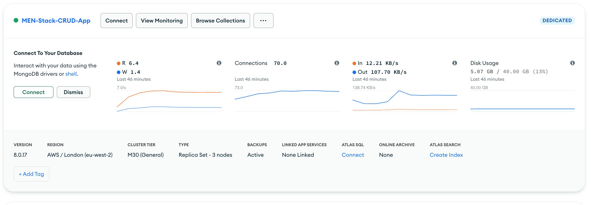

# MEN Stack CRUD App – Plants

A full-stack CRUD application built using the MEN stack (MongoDB, Express, Node.js) with EJS for server-side rendering.  
This project was completed as part of the **MEN Stack CRUD App Lab**.

---

## 📖 Description

This application allows users to perform full **Create, Read, Update, and Delete (CRUD)** operations on a resource called **Plants**.  
Data is persisted using **MongoDB Atlas**, and views are rendered using **EJS templates**.

The app follows RESTful routing conventions and demonstrates a complete MEN stack workflow.

---

## 🛠️ Tech Stack

- Node.js
- Express
- MongoDB Atlas
- Mongoose
- EJS
- method-override
- dotenv
- morgan
- nodemon (development)

---

## 📂 RESTful Routes

| HTTP Method | Route            | Action  | Description                        |
|------------|------------------|---------|------------------------------------|
| GET        | /plants          | Index   | Display all plants                 |
| GET        | /plants/new      | New     | Show form to create a new plant    |
| POST       | /plants          | Create  | Create a new plant                 |
| GET        | /plants/:id      | Show    | Show a single plant                |
| GET        | /plants/:id/edit | Edit    | Show form to edit a plant          |
| PUT        | /plants/:id      | Update  | Update a specific plant            |
| DELETE     | /plants/:id      | Destroy | Delete a specific plant            |

---

## 📸 Screenshots

### MongoDB Atlas Collection

